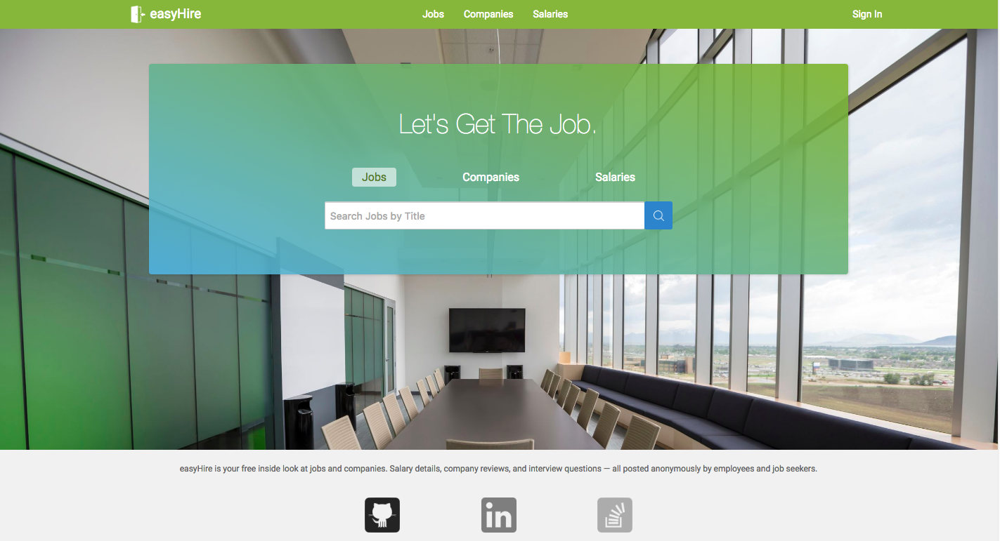
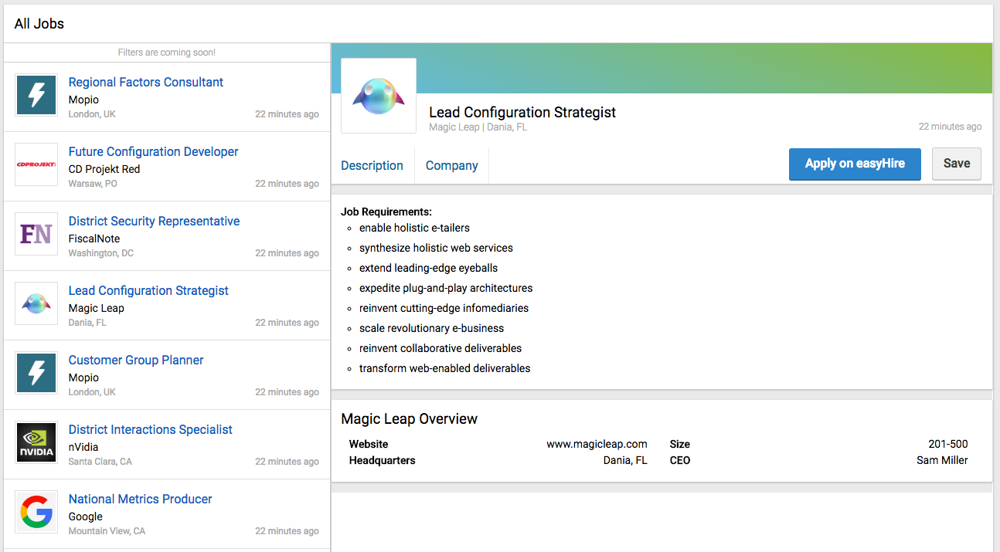
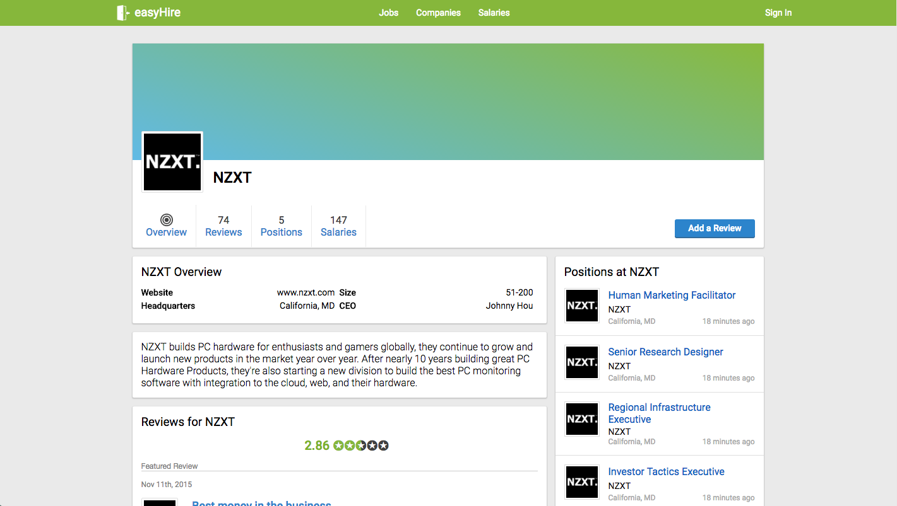
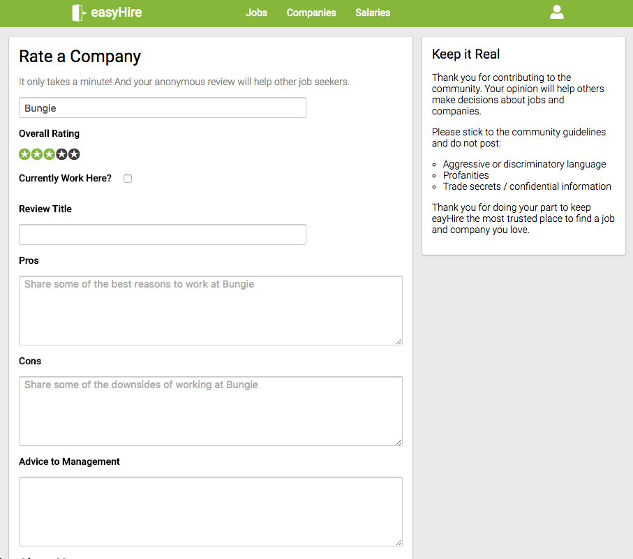
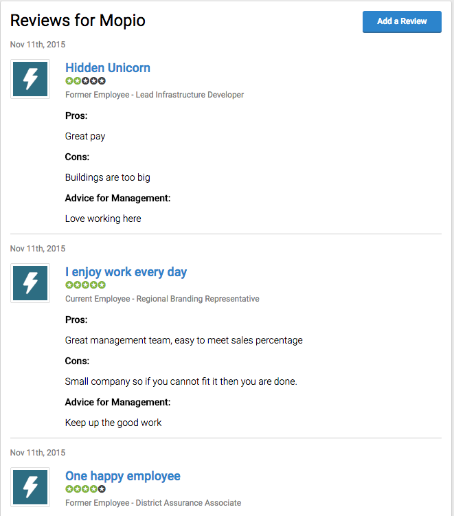

# easyHire

[easyHire live!](easy-hire.me)

easyHire is a full-stack web application inspired by [Glassdoor](www.glassdoor.com). It is implemented with a Ruby on Rails backend, a PostreSQL database, and a Redux-style frontend done with React.js.

## Features

### Job Postings

At it's core, easyHire is about job-hunting, allowing seekers to search for postings, save them to a list, and apply to them with a resume. The postings are stored under one table in the database, with columns for all the properties of a posting. Posting saves and applications are stored under join tables that contain columns for the `user_id` and the `posting_id`.

Seekers can find job postings in several different locations with two main flavors, a condensed posting and a detailed posting. There is a dedicated `Jobs` tab where users can search for jobs by name, and browse a list of matching jobs. Clicking upon one of the condensed items brings the details of that posting into the main window.

### Companies

Another key feature of easyHire is the ability to search for companies by name and see details about a particular company. Companies are stored somewhat similarly to Postings in the database, and rendered using a similar React component structure. Upon visiting the `Companies` section of the website, users are greeted with a `CompaniesIndex` of all the entities on easyHire, with the ability to filter by name. The list of companies is stored in the `CompanyStore`, with a specific company's details stored under the `CompanyDetail` section of that store. Clicking on a `CompanyIndexItem` takes the user to that company's detail page, which lists things like a description, stats container, and a sidebar of related jobs.

### Reviews

Finally, easyHire allows users to review the companies they have worked for. In multiple places throughout the site there are links to `Add a Review`, which take logged in users to a `ReviewFormComponent` where the user can leave feedback, including pros, cons, and advice for management.

Reviews are stored in a separate table and belong to a company and a user through respective `company_id` and `user_id` properties. easyHire's reviews are anonymous however, and `user_id`s are only used server-side to make sure a particular user doesn't review a company more than once. (There are plans to expand this feature so users can rate multiple times)

Additionally a list of all reviews for a company is available for seekers to browse.

## Future Directions for easyHire

- Filters:
  - Seekers should be able to use dropdown menus to filter either jobs, companies, or salaries by certain characteristics, such as job type, posting age, or company industry (to be added to database as well).

- Salaries:
  - Another huge feature for a job-hunting website. Users should be able to search for positions, or companies and see what that position or company pays, compared to a national average.
  - As with reviews, these salaries are anonymous, and authorship is only used server-side to prevent spam.

- Employers:
  - A new class of account, employers would be able to create and edit job postings through a special dashboard accessible only to them, after verification of company email.
  - This dashboard would also display certain performance metrics of the active postings that employer currently has, such as number of applicants over time.

- Rich Text
  - Enable rich text formatting and display for company and posting descriptions, and for resume input.

##### Feedback

Want to leave feedback for the easyHire team? Send an email to easy-hire@mailinator.com and leave us a note!
